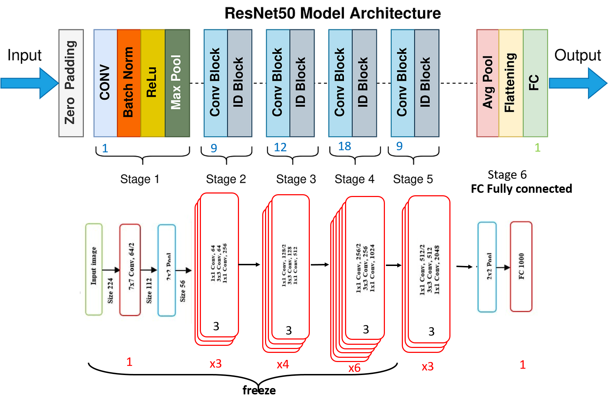
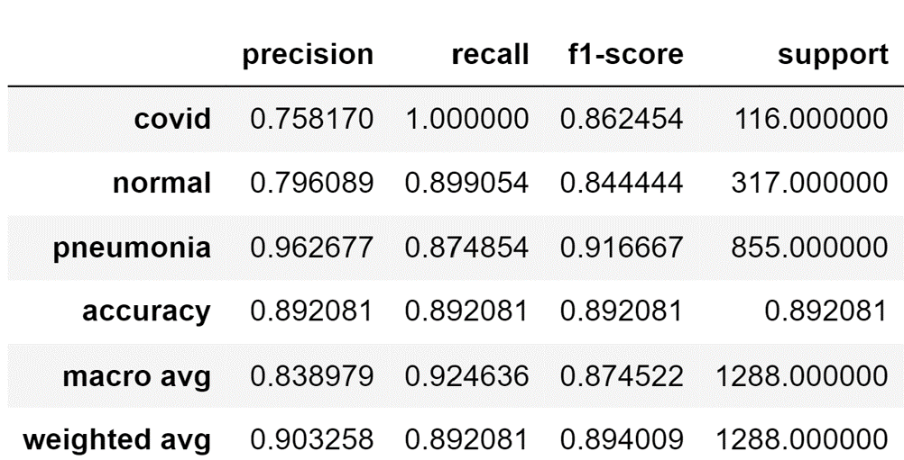

# Chest-X-Ray-Classification-Using-CNN-transfer-learning

Le but de ce notebook est la détection et la classification automatiques des maladies pulmonaires à partir des images de radiographie thoracique, particulièrement la pneumonie qui est une infection respiratoire aiguë du tissu pulmonaire ainsi que l'infection au COVID-19.    
J’utilise l’apprentissage de transfert ou transfer learning pour entrainer un réseau neuronal convolutif (Convolutional Neural Networks, CNN), une architecture réseau pour l'apprentissage profond ou Deep Learning, tout en expliquant en détail les différentes étapes.

## Données

L’ensemble des données que j'utilise provient de la bibliothèque kaggle. Il est divisé dans 2 repertoires train et test, contenant chacun 3 sous-répertoires (covid, pneumonia, normal). Le nombre total d'images est de 6432 dont 20% en test. 

## Etapes du projet 
### 1. Prétraitement d’images

### 2. Architecture du modèle ResNet50 utilisée 

### 3. Résultats 

    
     
Sources :           
Ce travail est basé sur l'article [Automatic Detection of COVID-19 Disease in Chest X-Ray Images using Deep Neural Networks]
Lien de téléchargement des données : https://www.kaggle.com/datasets/prashant268/chest-xray-covid19-pneumonia  
